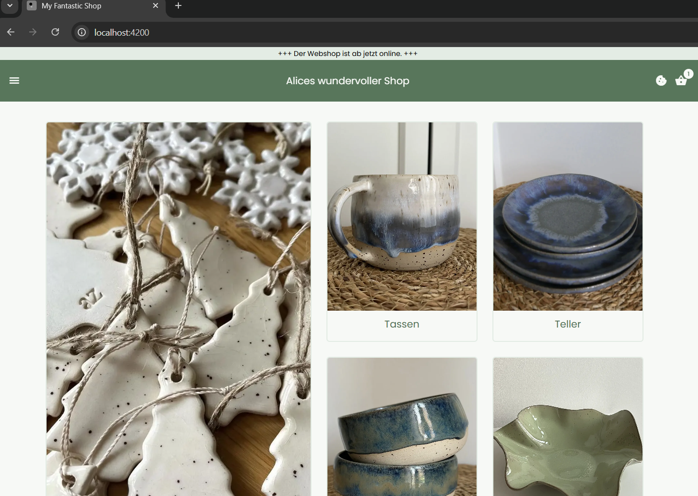
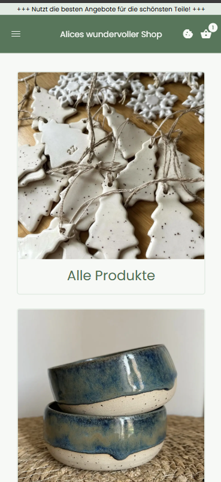
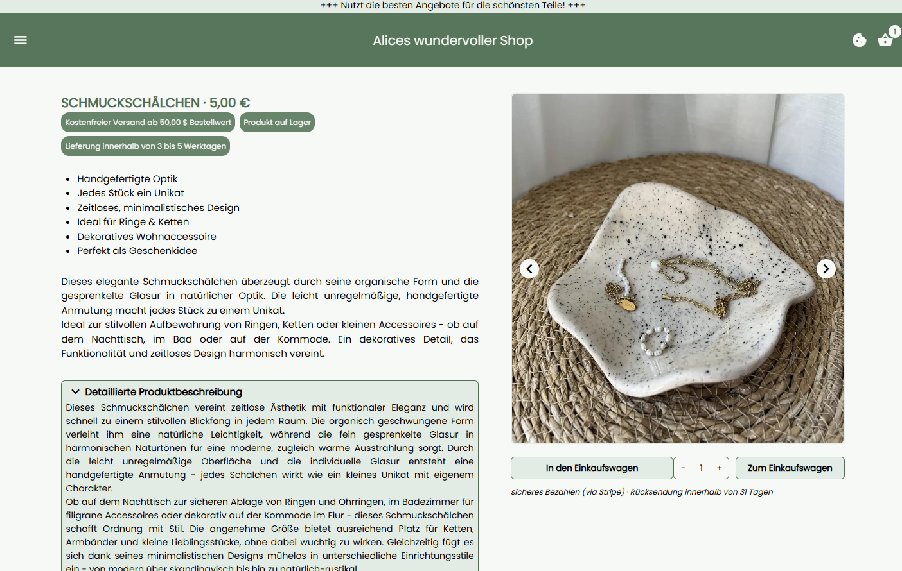
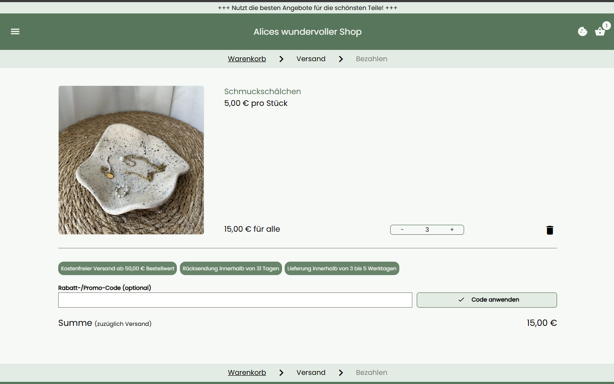
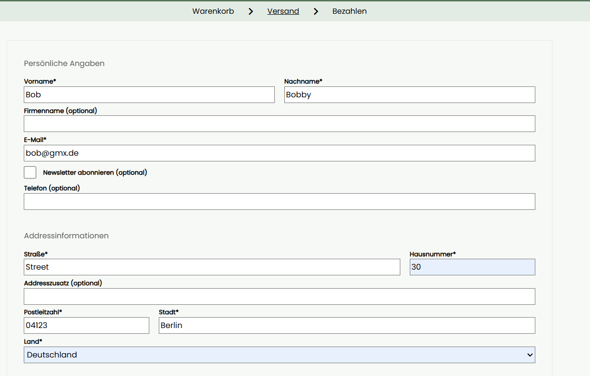
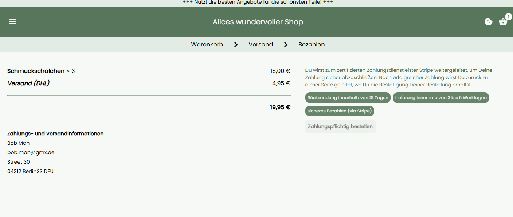
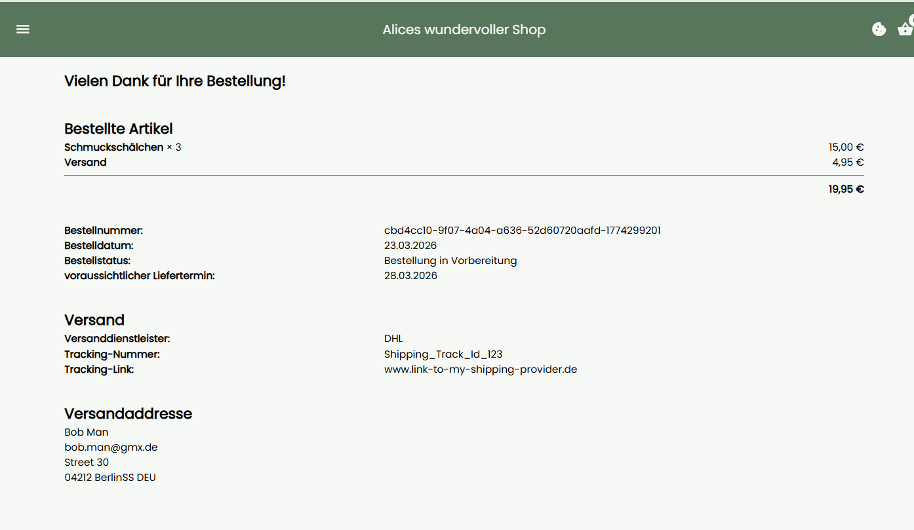
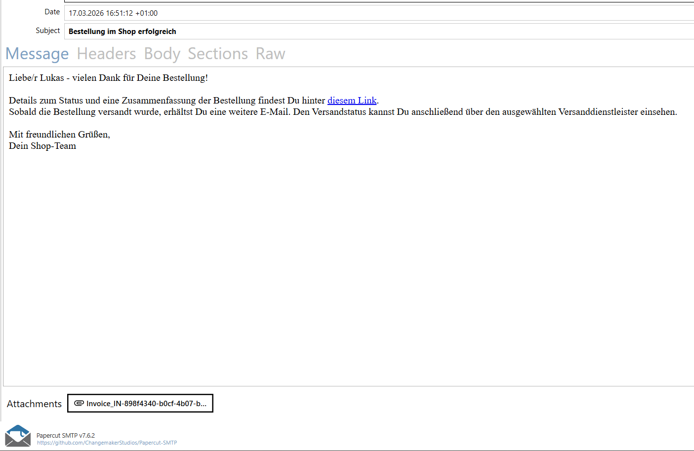

 

# Overview

LittleSimpleShop is a learning-project that employs various techniques and technologies. It mainly serves as a training ground for me to learn, experiment and explore in order to deepen my technical understanding (_without_ the use of AI). \
The general goal is to implement a minimal Shop-/E-Commerce-Website that combines services to handle the presentation of products and the ordering process. Some parts of the application are meant to be extended (see Issues). \
Since the main purpose of the project is to give me a playground to test out code, services, CI and practices, I tried to cover different areas of the development process (even if it is only a minimal proof of concept). \
Aside from lacking features, the final step of a productive/test deployment is not done and not prepared yet.

# Features

Using an arbitrary color scheme and the german internationalized resources, we might get that starting page:

Mobile:

As you see, the exemplary shop ("Alices wundervoller Shop") is a pottery shop, some pictures are supplied. \
Within the product show sites, we have some basic actions and product infos:

The checkout process is modelled as a breadcrumb path, collecting address info and redirecting to stripe:

... supply address info and shipping info ...

... you are redirected to the stripe payment form if you process further ...

After a successful checkout, you can track your order...

... and you get an email with an invoice, which has a very basic template, but can be prettified.

# Structure and Tech

The project mainly consists of a backend (ASP .NET Core Web API) and a frontend (Angular SPA). \
The implementation includes and employs the following tech/practices/dependencies:

- SQL Server as a database using EF Core as ORM and FluentMigrator for migrations
- checkout workflow as an anonymous user
- double submit approach for implementing an anti-forgery token with the API and SPA (Cookie and Header)
- serving images and documents via the file storage system SeaweedFS including a creation workflow for invoices
- creating PDF-invoices utilizing a templating engine to fill a html that gets converted by the PDF converter service Gotenberg
- sending E-Mails using MailKit
- payment via interfacing the Stripe API - that covers a secure payment handling utilizing the stripe payment form, using the webhook upon succeeded payment and handling those results
- setup for not yet implemented features: collecting newsletter email, presenting cookie (Datenschutz) information extendible for further use of private data
- source generator mapper Mapperly
- logging with Serilog
- minimal test setup (no exhaustive coverage yet)

The project includes Dockerfiles for the API and the frontend, and a Docker-compose file to start these two and the depending services/database. \
Two basic github action workflows build and test the projects parts.

# Run with Docker

Use the appsettings.Docker.json and app.config.docker.json for the respective projects as a base to build the Docker-images. \
Before building, you must adapt these config files if you want to fully use the shop. Most of the settings properties are suited for the setup defined by the docker-compose file, however the Stripe keys and the SMTP server properties need configuration:

- in appsettings.json, update **StripePrivateKey** and **StripeWebhookSecret** to match yours (see https://docs.stripe.com/keys, you need a Stripe account for the setup). Use only the test (sandbox) keys for this project, since it is currently in a dev/test stage
- in appsettings.json, update the **EMail** section to match a test server setup. My tests use Papercut SMTP outside of the container as a toy setup to receive and see incoming messages. A mail server is currently not part of the docker compose.
- in app.config.json, update **stripePublicKey** to match your respective key (see above)

The current handling of secrets via the config files is only suited for dev and test scenarios. Prod usage requires a hardened approach via other means (secret vault...). \
Finally you can build the images:
`docker build ./ -t "shop-ng-app:latest" --no-cache`
`docker build ./ -t "shop-api:latest" --no-cache`

Next, we need some final setup to prepare the docker compose. \
To have a working Stripe webhook, we need to listen to listen to events and forward them as a way to test the functionality locally. See https://docs.stripe.com/webhooks (under #2) and use:
`stripe listen --forward-to https://localhost:443/shop/Payment/PersistSuccessfulStripePaymentResult --log-level=debug`
This matches the exposed API service, which will be created soon. \
The API uses https, so you need to configure a cert (https://learn.microsoft.com/en-us/aspnet/core/security/docker-https?view=aspnetcore-7.0), which will be bound by a volume to the container. You can find an env variable in the compose file, **SHOP_API_PATH_TO_HTTPS**. Create that env var with a path to the dev cert. \
Some further adjustments should be done in the docker compose file. You should change the password of the SQL server instance. You can uncomment the code to reach the server from the host machine in order to add actual data to the shop, like products, categories and images. This might also require to expose SeaweedFS ports to the host. \
You can now run `docker compose up` in the compose files directory. You should be able to access the SPA at http://localhost. \
Currently, no UI management for the shops actual content is available. The products and categories have to be filled manually.

# ToDo's and open issues

As can be seen under the issues section, there is some open work to do including testing, productive deployment preparation and security hardening. \
Furthermore, feature extension ideas come to mind quickly and range from an account-/login-functionality to a search function and more fine-tuned product detail site. On top of this, the whole solution can be expanded into a more full-fetched E-commerce system, allowing to manage the contents - think of a multi-tenant approach, that suits the shop use case.

# License

MIT License \
Copyright (c) 2026 \
Permission is hereby granted, free of charge, to any person obtaining a copy of this software and associated documentation files (the "Software"), to deal in the Software without restriction, including without limitation the rights to use, copy, modify, merge, publish, distribute, sublicense, and/or sell copies of the Software, and to permit persons to whom the Software is furnished to do so, subject to the following conditions: \
The above copyright notice and this permission notice shall be included in all copies or substantial portions of the Software. \
THE SOFTWARE IS PROVIDED "AS IS", WITHOUT WARRANTY OF ANY KIND, EXPRESS OR IMPLIED, INCLUDING BUT NOT LIMITED TO THE WARRANTIES OF MERCHANTABILITY, FITNESS FOR A PARTICULAR PURPOSE AND NONINFRINGEMENT. IN NO EVENT SHALL THE AUTHORS OR COPYRIGHT HOLDERS BE LIABLE FOR ANY CLAIM, DAMAGES OR OTHER LIABILITY, WHETHER IN AN ACTION OF CONTRACT, TORT OR OTHERWISE, ARISING FROM, OUT OF OR IN CONNECTION WITH THE SOFTWARE OR THE USE OR OTHER DEALINGS IN THE SOFTWARE.
